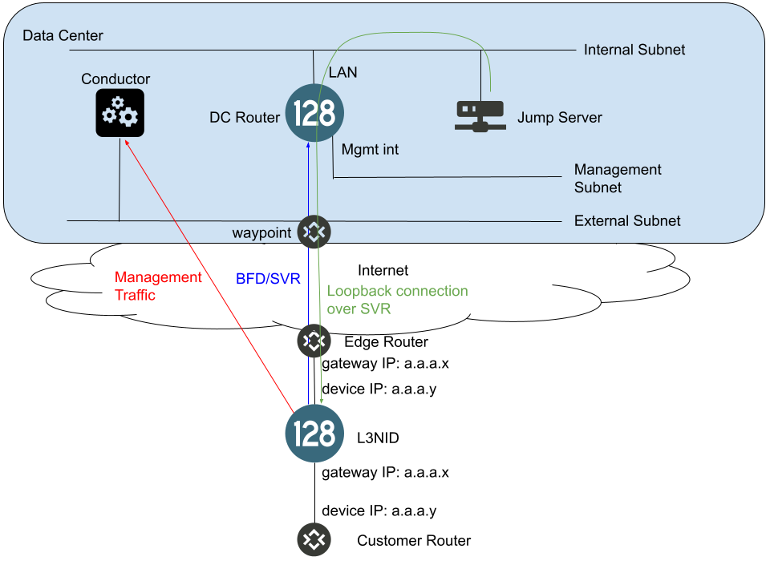

# Layer 3 NID Onboarding

Welcome to the Layer 3 NID onboarding repo. This repo is intended to provide a way to rapidly setup an evaluation environment for the Juniper SSR Layer 3 NID product. 

## Solution Components

- ***Conductor*** - the conductor is the management and orchestration function for an Authority (collection of routers, tenants, services, and policies). The conductor is the provisioning interface for all routers. Configuration templates are provided to rapidly deploy the base configuration as well as the L3NID routers. Once a L3NID has been provisioned, a quickstart containing the router's configuration can be downloaded from the conductor to configure the physical device.
- ***Provisioner*** - the provisioner is provided to give an example of leveraging the Conductor APIs to provision the L3NID using the templates. It should provide a facsimile of a back office provisioning system and CSR entry portal. This should be helpful when attempting to integrate the solution into your provisioning system.
- ***DC Router*** - the datacenter router is the termination point for peer paths from the L3NID routers. The L3NID sends BFD traffic over the peer path and samples the replies in order to measure the SLA of the path. Additionally, the router will accept connections on the LAN interface towards management loopback interfaces on the L3NID and allow you to SSH into the L3NID.
- ***Jumper*** - the jumper is a simple server connected to the LAN of the DC Router and is provided to give a point to initiate SSH connections towards the L3NID management loopback addresses.
- ***L3NID*** - The L3NID router provides a demarcation point when delivering a circuit to a customer. The L3NID will measure the SLA of the circuit, provide insight into the customer's traffic, and provide a location for troubleshooting issues through packet captures.
- ***Blaster*** - The blaster provides a method to install the 128T software onto the hardware that will become a L3NID. Additionally the blaster functions as a bootstrap server, downloading quickstarts from the conductor and applying them to a specific piece of hardware before shipping to the customer site. This will ensure the system has the correct static IP on the WAN and can connect to the conductor.

## Staging the Infrastructure

The Conductor, provisioner, DC Router, and Jumper can be built in a lab infrastructure using whitebox hardware or virtualized. The suggested architecture for his is shown below.

For rapid prototyping, these elements can all be built in AWS in an automated manner. Simply follow the instructions to [deploy in AWS](aws/README.md).

## Provision a L3NID in conductor

## Stage the L3NID hardware

The blaster can be used to stage whitebox hardware. The blaster includes both a PXE boot server customized to work with official SSR ISOs and a quickstart server as per the [Session Smart Router bootstrapping procedure](https://docs.128technology.com/docs/intro_otp_iso_install/). Please download and install the blaster following the instructions on the [blaster's GitHub repository](https://github.com/128technology/blaster).

Once the blaster has been installed, please browse to the server's management IP address. There is help text provided in the blaster to guide you in performing the following tasks, which are needed to start blasting:
- Upload an official yum certificate in order to gain access to the SSR ISOs
- Download and stage an OTP ISO of the appropriate version (5.1.3 or later)
- Set the ISO as active for blasting
- Add a conductor to the blaster to assist in quickstart preparation
- List nodes for the newly configured conductor and download the quickstart associated with the router that was previously provisioned

At this point, attach the L3NID hardware to the blasting switch and power it on. Certain hardware may only PXE boot on specific ports, so some experimentation may be required. Additionally, PXE boot may need to be triggered manually through the BIOS menu if the system already has partitions installed on the hard drive. Once the PXE boot process starts successfully, it should complete in about 45 minutes and afterwards the system will power off. It is suggested to follow on the L3NID hardware's console during the first system's installation process.

After the installation has completed and the system has powered off, return to the blaster's web interface and navigate to the Manage Nodes menu. In the table, you should see an entry for the system that was just provisioned starting with its hardware identifier (typically system serial number from DMI). Using the dropdown boxes, select the conductor, router name, and node name corresponding to the quickstart previously retrieved from the conductor. Click the Associate Quickstarts button. At this point it is safe to power on the system again. On this boot, the hardware will go through its bootstrapping process and should retrieve the appropriate quickstart from the blaster. It will reboot itself when completed. The system is now ready to ship to the appropriate site and will come up with the correct static IP address on the WAN and connect back to the conductor.
