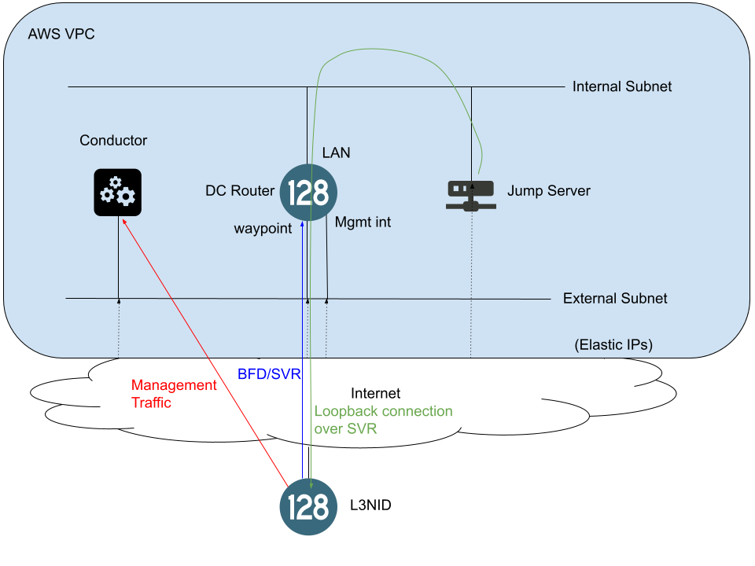

# L3NID AWS Setup

## Topology



## AWS Base Setup

1. Prepare AWS Account

In order to build this project, you will need an AWS IAM user configured with the appropriate permissions (see Appendix A). See the AWS documentation for [Creating an IAM User](https://docs.aws.amazon.com/IAM/latest/UserGuide/id_users_create.html) and [Policies and Permissions in IAM](https://docs.aws.amazon.com/IAM/latest/UserGuide/access_policies.html). This user must have an API Access Key generated. See the AWS documentation for [Managing Access Keys](https://docs.aws.amazon.com/IAM/latest/UserGuide/id_credentials_access-keys.html#Using_CreateAccessKey). Also, be sure to create or upload an SSH key pair used to login to these instances in the AWS Region to which you plan to build this project. See the AWS documentation [here](https://docs.aws.amazon.com/AWSEC2/latest/UserGuide/ec2-key-pairs.html) for more information.

2. Install awscli and setup the user's access key

The AWS CLI will be used to setup authentication of the account from Step 1 so that it can be used to authenticate with the AWS APIs. Please follow the instructions provided in the AWS Documentation to [Install the AWS CLI](https://docs.aws.amazon.com/cli/latest/userguide/cli-chap-install.html) which are appropriate for your Operating System.

Once the AWS CLI is installed, configure the IAM user for access by running "aws configure" and enter access key info as shown below.
```
[t128@lanevm aws_base]$ aws configure
AWS Access Key ID [None]: <access key ID obtained in Step 1>
AWS Secret Access Key [None]: <access key value obtained in Step 1>
Default region name [None]: <Enter>
Default output format [None]: <Enter>
```

3. Request SSR AMI

As of today, the official SSR AMI needed for this effort is not available in the AWS Marketplace. Please request to your Juniper account team to have this AMI shared with your account. You will need to provide your AWS account number.

4. Build the Infrastructure with Terraform

At this point, it is time to build the infrastructure in AWS. Please follow the instructions to [build the infrastructure iwth Terraform](terraform/README.md)

## Steps to Build

4.1. Install Terraform

Download the appropriate Terraform binary for your Operating System from the [official Terraform download page](https://www.terraform.io/downloads.html). Extract the archive to obtain the binary and place the file in your user's PATH.

4.2. Initialize Terraform

Inside the repo's aws/terraform directory, initialize the project and download the required terraform modules by running `terraform init`

4.3. Setup project variables

Inside the repo's aws/terraform directory, create a file named `me.auto.tfvars` in the terraform directory. In this file, we will create variable overrides. There are many variables to this project that can be overridden. It is safe to use most variable defaults unless you have a specific reason to override them. However, three variables should be configured as shown below. Set the `key_name` to use the name of the key pair created in Step 1 that will be used to login to the instances. Set the `aws_region` to the valid name of the AWS region to which you plan to build the project. Set the `aws_availability_zone` to the valid name of an availability zone in this region to which you want to build the project (typically using "a" is satisfactory). For more information on AWS Regions and Availability Zones, please see the [AWS Documentation](https://docs.aws.amazon.com/AWSEC2/latest/UserGuide/using-regions-availability-zones.html).

At a minimum, the following variables should be set in the `me.auto.tfvars` file with values corresponding to your setup:
- ***key_name*** - The name of the AWS keypair to setup for SSH authentication on the instances.
- ***aws_region*** - The name of the AWS region to use when building the topology, this region must contain the two AMIs needed.
- ***aws_availability_zone*** - The availability zone within the region to use when building the topology. It typically does not matter which availability zone within the region is used, but a valid entry must be provided.
- ***t128_ami*** - The AMI provided by Juniper containing the SSR software

4.4. Build the project

The project can now be built by running the command `terraform apply` inside the repo's aws/terraform directory. This will likely take several minutes. At the end of the process, the elastic IP addresses AWS assigned to the management IP of the three instances will be returned as shown below:

```
Outputs:

conductor_address = "13.37.10.141"
dc-ip = "35.181.164.206"
jumper-ip = "13.36.71.100"
```

If needed, these can be obtained again by running `terraform output` from the terraform directory.

5. Login to conductor

Please allow at least 5 minutes for the Conductor to come up fully and then point a browser to `https://<conductor_address>`. The default credentials are admin/128tRoutes.

## Appendix A: Required AWS Permissions
Below is the list of AWS permissions required for the AWS account used to build the terraform.

```
sts/GetCallerIdentity  
sts/GetCallerIdentity  
ec2/DescribeAccountAttributes  
ec2/DescribeImages  
ec2/DescribeImages  
sts/GetCallerIdentity  
sts/GetCallerIdentity  
ec2/DescribeAccountAttributes  
ec2/AllocateAddress  
ec2/CreateVpc  
ec2/AllocateAddress  
ec2/AllocateAddress  
ec2/AllocateAddress  
ec2/CreateTags  
ec2/CreateTags  
ec2/CreateTags  
ec2/CreateTags  
ec2/DescribeVpcs  
ec2/DescribeAddresses  
ec2/DescribeAddresses  
ec2/DescribeAddresses  
ec2/DescribeAddresses  
ec2/DescribeVpcs  
ec2/DescribeVpcAttribute  
ec2/DescribeVpcAttribute  
ec2/DescribeVpcClassicLink  
ec2/DescribeVpcClassicLinkDnsSupport  
ec2/DescribeRouteTables  
ec2/DescribeNetworkAcls  
ec2/DescribeSecurityGroups  
ec2/DescribeRouteTables  
ec2/CreateSubnet  
ec2/CreateRouteTable  
ec2/CreateSubnet  
ec2/CreateSecurityGroup  
ec2/CreateSecurityGroup  
ec2/CreateSecurityGroup  
ec2/CreateSecurityGroup  
ec2/CreateInternetGateway  
ec2/CreateRouteTable  
ec2/DescribeRouteTables  
ec2/DescribeRouteTables  
ec2/DescribeInternetGateways  
ec2/DescribeSubnets  
ec2/DescribeSecurityGroups  
ec2/DescribeSecurityGroups  
ec2/DescribeSubnets  
ec2/DescribeSecurityGroups  
ec2/DescribeSecurityGroups  
ec2/AttachInternetGateway  
ec2/DescribeRouteTables  
ec2/DescribeRouteTables  
ec2/RevokeSecurityGroupEgress  
ec2/RevokeSecurityGroupEgress  
ec2/DescribeSubnets  
ec2/DescribeSubnets  
ec2/RevokeSecurityGroupEgress  
ec2/RevokeSecurityGroupEgress  
ec2/AssociateRouteTable  
ec2/RevokeSecurityGroupEgress  
ec2/RevokeSecurityGroupEgress  
ec2/DescribeInternetGateways  
ec2/RevokeSecurityGroupEgress  
ec2/RevokeSecurityGroupEgress  
ec2/AssociateRouteTable  
ec2/DescribeInternetGateways  
ec2/DescribeSecurityGroups  
ec2/DescribeSecurityGroups  
ec2/DescribeSecurityGroups  
ec2/DescribeSecurityGroups  
ec2/CreateRoute  
ec2/CreateRoute  
ec2/AuthorizeSecurityGroupIngress  
ec2/AuthorizeSecurityGroupIngress  
ec2/AuthorizeSecurityGroupIngress  
ec2/AuthorizeSecurityGroupIngress  
ec2/DescribeRouteTables  
ec2/AuthorizeSecurityGroupEgress  
ec2/AuthorizeSecurityGroupEgress  
ec2/DescribeRouteTables  
ec2/DescribeSecurityGroups  
ec2/AuthorizeSecurityGroupEgress  
ec2/DescribeRouteTables  
ec2/DescribeRouteTables  
ec2/DescribeSecurityGroups  
ec2/DescribeSecurityGroups  
ec2/DescribeSecurityGroups  
ec2/CreateNetworkInterface  
ec2/CreateNetworkInterface  
ec2/CreateNetworkInterface  
ec2/CreateNetworkInterface  
ec2/CreateNetworkInterface  
ec2/DescribeNetworkInterfaces  
ec2/DescribeNetworkInterfaces  
ec2/DescribeNetworkInterfaces  
ec2/DescribeNetworkInterfaces  
ec2/DescribeNetworkInterfaces  
ec2/DescribeNetworkInterfaces  
ec2/DescribeNetworkInterfaces  
ec2/DescribeNetworkInterfaces  
ec2/ModifyNetworkInterfaceAttribute  
ec2/ModifyNetworkInterfaceAttribute  
ec2/AssociateAddress  
ec2/AssociateAddress  
ec2/DescribeImages  
ec2/AssociateAddress  
ec2/DescribeImages  
ec2/DescribeNetworkInterfaces  
ec2/DescribeNetworkInterfaces  
ec2/RunInstances  
ec2/RunInstances  
ec2/DescribeAddresses  
ec2/DescribeAddresses  
ec2/CreateRoute  
ec2/AssociateAddress  
ec2/DescribeImages  
ec2/DescribeAddresses  
ec2/RunInstances  
ec2/DescribeRouteTables  
ec2/DescribeAddresses  
ec2/DescribeRouteTables  
ec2/DescribeInstances  
ec2/DescribeInstances  
ec2/DescribeInstances  
ec2/DescribeInstances  
ec2/DescribeVpcs  
ec2/DescribeVolumes  
ec2/DescribeInstances  
ec2/DescribeInstances  
ec2/DescribeInstanceAttribute  
ec2/DescribeInstanceAttribute  
ec2/DescribeInstances  
ec2/DescribeInstances  
ec2/DescribeInstances  
ec2/DescribeInstances  
ec2/DescribeVpcs  
ec2/DescribeVpcs  
ec2/DescribeVolumes  
ec2/DescribeVolumes  
ec2/DescribeInstanceAttribute  
ec2/DescribeInstanceAttribute  
ec2/DescribeInstanceAttribute  
ec2/DescribeInstanceAttribute  
ec2/DescribeInstanceCreditSpecifications  
ec2/DescribeInstanceCreditSpecifications  
```
