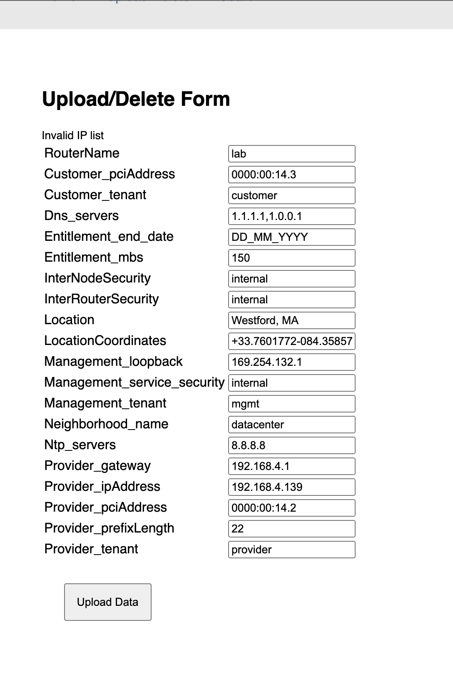
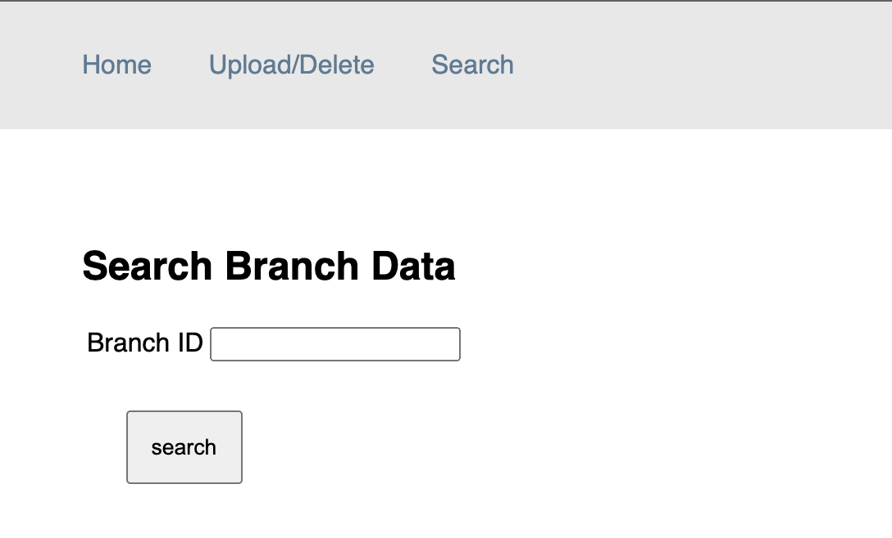
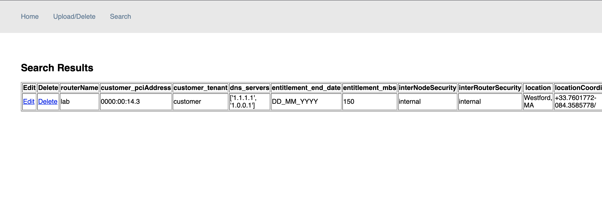
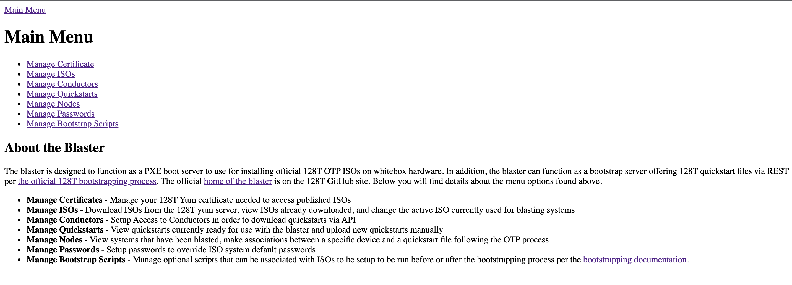
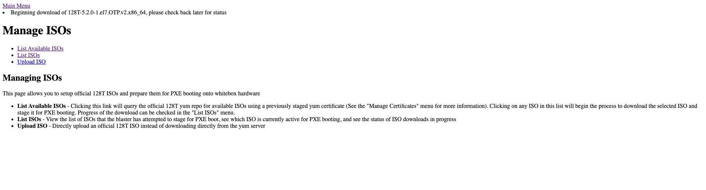
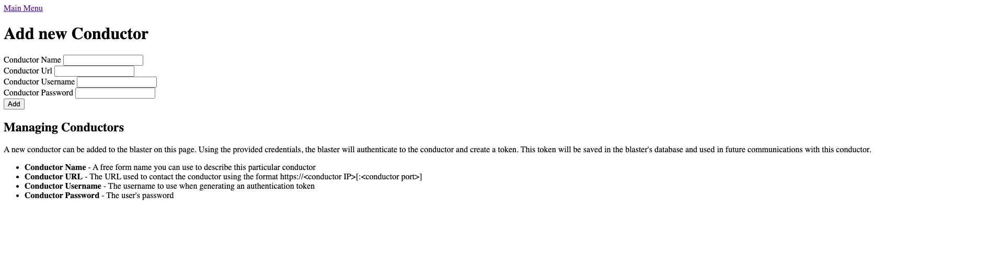
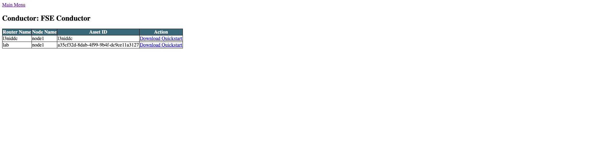
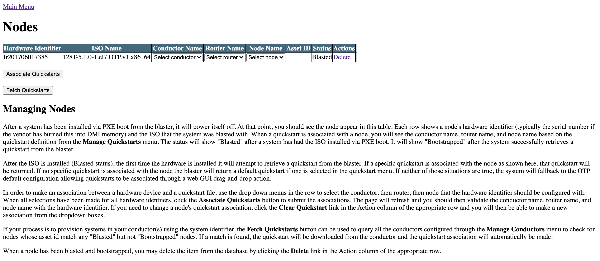

## FSE Onboarding Cheat Sheet


### 1. Spinning up the conductor and provisioner on AWS

#### a. Clone the FSE Onboarding git hub repo on your machine

```
user@user-mbp /tmp % git clone https://github.com/128technology/fse-onboarding.git
Cloning into 'fse-onboarding'...
remote: Enumerating objects: 147, done.
remote: Counting objects: 100% (147/147), done.
remote: Compressing objects: 100% (120/120), done.
remote: Total 147 (delta 21), reused 146 (delta 21), pack-reused 0
Receiving objects: 100% (147/147), 834.60 KiB | 5.42 MiB/s, done.
Resolving deltas: 100% (21/21), done.
user@user-mbp /tmp %
```
#### b. Spin up AWS instances

- cd into the `aws/terraform` directory of the cloned repo

```
user@user-mbp terraform % pwd
/Users/user/Workspace/fse-onboarding/aws/terraform
user@user-mbp terraform %
```

- Create / Modify the `me.autho.tfvars` file within the `terraform` directory by adding the following fields.
- The `conductor_ami` info will be shared to you.

> NOTE: Replace the values to what's appropriate to your case. Like region, router_ami, key_name, etc


```
user@user-mbp terraform % cat me.auto.tfvars
conductor_ami = "ami-083d3abb0ef298981"
key_name = "user_rsa"
aws_region = "eu-west-3"
aws_availability_zone = "eu-west-3a"
router_ami = "ami-0a26d289f72008501"
user@user-mbp terraform %
```


- Run the `terraform apply` command to spin up the resources.
- On the interrupt prompt, type `yes`
- Upon completion, the terraform will output the IPs of the resources.

For example:

```
Apply complete! Resources: 31 added, 0 changed, 0 destroyed.

Outputs:

conductor_address = "15.188.31.228"
dc-ip = "13.36.42.22"
jumper-ip = "52.47.152.204"
user@user-mbp terraform %
```

- After a while, including a reboot, the provisioner and database containers should be up. You can now `ssh` into the conductor.

`ssh centos@<conductor_address>`

- Verify the `provisioner` and `local database` containers are running.

```
[centos@ip-192-168-0-100 ~]$ docker ps
CONTAINER ID   IMAGE                    COMMAND                  CREATED         STATUS         PORTS                                       NAMES
9e773dceba26   fse-provisioner:v0.0.1   "/bin/sh -c 'bash -c…"   3 minutes ago   Up 9 seconds   0.0.0.0:3006->3006/tcp, :::3006->3006/tcp   provisioner_PROV_1
30a7b9f660b3   provisioner_web          "python3 /var/www/ap…"   3 minutes ago   Up 2 minutes   0.0.0.0:5000->5000/tcp, :::5000->5000/tcp   provisioner_web_1
[centos@ip-192-168-0-100 ~]$

```

### 2. Uploading branch data to Database

Navigate to the Database webpage

Home Page: http://conductor_ip:5000/home

Upload branch data: http://conductor_ip:5000/upload

View Branch Data: http://conductor_ip:5000/search


- Enter the branch data



- This data can be viewed on the search bar in the Databases' webpage in the http://conductor_ip:5000/search URL by entering the branch ID.





- This data is stored in a file on the Conductor, in the directory `/home/centos/provisioner/database`. In this example, its the `lab.yml`

```
[centos@ip-192-168-0-100 database]$ pwd
/home/centos/provisioner/database
[centos@ip-192-168-0-100 database]$


[centos@ip-192-168-0-100 database]$ ls
base.yml  lab.yml
[centos@ip-192-168-0-100 database]$

```

```
[centos@ip-192-168-0-100 database]$ cat lab.yml
name: lab
variables:
  customer_pciAddress: '0000:00:14.3'
  customer_tenant: customer
  dns_servers:
  - 1.1.1.1
  - 1.0.0.1
  entitlement_end_date: DD_MM_YYYY
  entitlement_mbs: '150'
  interNodeSecurity: internal
  interRouterSecurity: internal
  location: Westford, MA
  locationCoordinates: +33.7601772-084.3585778/
  management_loopback: 169.254.132.1
  management_service_security: internal
  management_tenant: mgmt
  neighborhood_name: datacenter
  ntp_servers:
  - 8.8.8.8
  provider_gateway: 192.168.4.1
  provider_ipAddress: 192.168.4.139
  provider_pciAddress: '0000:00:14.2'
  provider_prefixLength: '22'
  provider_tenant: provider
  routerName: lab
[centos@ip-192-168-0-100 database]$

```

### 3. Configuring the branch on the conductor

- Log into the Provisioner container on the conductor as shown.

```
[centos@ip-192-168-0-100 database]$ docker ps
CONTAINER ID   IMAGE                    COMMAND                  CREATED          STATUS          PORTS                                       NAMES
9e773dceba26   fse-provisioner:v0.0.1   "/bin/sh -c 'bash -c…"   26 minutes ago   Up 23 minutes   0.0.0.0:3006->3006/tcp, :::3006->3006/tcp   provisioner_PROV_1
30a7b9f660b3   provisioner_web          "python3 /var/www/ap…"   26 minutes ago   Up 25 minutes   0.0.0.0:5000->5000/tcp, :::5000->5000/tcp   provisioner_web_1
```

```
[centos@ip-192-168-0-100 database]$ docker exec -it provisioner_PROV_1 bash
[root@provisioner] fse-cmd-runner#
```

- Use the following command to apply the branch config to the conductor

```
[root@provisioner] fse-cmd-runner# fse_add_store --help
Usage: fse_add_store [OPTIONS] [ROUTERS]...

Options:
  -v, --verbose         Print more details while running, and more detailed
                        summary of results.

  --template-name TEXT  The name of the config template to apply.  [required]
  --force               Force upload the template (when existing).
  --use-test-db         Connect to local test database instead of production
                        database.

  --render-template     Perform commit after applying template.
  --perform-commit      Perform commit after applying template.
  -h, --help            Show this message and exit.
[root@provisioner] fse-cmd-runner#

```
- Replace the branch name (In this case `lab`) with your router name

```
[root@provisioner] fse-cmd-runner# fse_add_store --use-test-db --render-template --perform-commit --force --template-name l3nid-add lab
INFO     - Adding stores lab
{'instances': [{'name': 'lab', 'variables': {'customer_pciAddress': '0000:00:14.3', 'customer_tenant': 'customer', 'dns_servers': ['1.1.1.1', '1.0.0.1'], 'entitlement_end_date': 'DD_MM_YYYY', 'entitlement_mbs': '150', 'interNodeSecurity': 'internal', 'interRouterSecurity': 'internal', 'location': 'Westford, MA', 'locationCoordinates': '+33.7601772-084.3585778/', 'management_loopback': '169.254.132.1', 'management_service_security': 'internal', 'management_tenant': 'mgmt', 'neighborhood_name': 'datacenter', 'ntp_servers': ['8.8.8.8'], 'provider_gateway': '192.168.4.1', 'provider_ipAddress': '192.168.4.139', 'provider_pciAddress': '0000:00:14.2', 'provider_prefixLength': '22', 'provider_tenant': 'provider', 'routerName': 'lab'}}]}
Uploaded template
INFO     - Commiting candidate config
Results:
  lab:
   - Retrieved entry from database:                                                  Success
[root@provisioner] fse-cmd-runner#
```


- The config should now be added to the conductor

NOTE: You can reach the pcli by running `su admin` on the Conductor Host.

```
admin@node1.conductor# show assets
Mon 2021-11-22 20:53:39 UTC

=========== ======= ====================================== ============== ============== ================ ========
 Router      Node    Asset Id                               128T Version   Status         Time in Status   Errors
=========== ======= ====================================== ============== ============== ================ ========
 conductor   node1   conductor                              5.1.3-1.el7    Running        28m 8s                0
 l3niddc     node1   l3niddc                                5.1.3-1.el7    Running        21m 23s               0
 lab         node1   a35cf32d-8dab-4f99-9b4f-dc9ce11a3127   None           Disconnected   28s                   0

Completed in 0.02 seconds
admin@node1.conductor#

```


### 4. Blasting


a. Setup Blaster

- Git clone the Blaster repo

```
[root@kvm tmp]# git clone https://github.com/128technology/blaster.git
Cloning into 'blaster'...
remote: Enumerating objects: 826, done.
remote: Counting objects: 100% (826/826), done.
remote: Compressing objects: 100% (435/435), done.
remote: Total 826 (delta 545), reused 636 (delta 383), pack-reused 0
Receiving objects: 100% (826/826), 383.68 KiB | 0 bytes/s, done.
Resolving deltas: 100% (545/545), done.
[root@kvm tmp]#

```

- Spin up the Blasting containers

```
[root@kvm ~]# cd blaster/
[root@kvm blaster]# ./setup.sh
```

- The interactive cli will auto-detect and ask for confirmation on the interfaces to use as `management` and `blasting`.
Type `yes` if that's the right interface else select the interface from the list.

```
It appears that the managemnt interface on this server is wlp0s20u4
Is this correct? (entering "list" will show your interfaces) [yes/no/list]

yes


It looks like these interfaces are available for the blasting network: enp2s0 enp3s0 virbr0 virbr0-nic wlp1s0
Please select an interface from this list (entering list will show your interface details)

enp2s0


It looks like these interfaces are available for the blasting network: enp2s0 enp3s0 virbr0 virbr0-nic wlp1s0
Please select an interface from this list (entering list will show your interface details)enp2s0
Using Management interface: wlp0s20u4 and blasting interface: enp2s0
```


- After completing setup, the blaster output should look like below

```
Network setup complete, building and starting the containers
Creating network "blaster_blasting" with driver "macvlan"
Creating blaster_tftp.uefi_1 ... done
Creating blaster_webapp_1    ... done
Creating blaster_dhcp_1      ... done
Creating blaster_tftp.bios_1 ... done
Blaster setup complete!
[root@kvm blaster]#
```


- To verify, run `docker ps`

```
[root@kvm blaster]# docker ps
CONTAINER ID   IMAGE     COMMAND                  CREATED          STATUS          PORTS     NAMES
b6babcafb208   tftp      "/usr/sbin/init"         25 seconds ago   Up 22 seconds             blaster_tftp.uefi_1
851405ae788f   webapp    "/usr/sbin/init"         25 seconds ago   Up 23 seconds             blaster_webapp_1
d910774ca623   tftp      "/usr/sbin/init"         25 seconds ago   Up 22 seconds             blaster_tftp.bios_1
bae3d6eb28c4   dhcp      "/usr/sbin/dhcpd -f …"   25 seconds ago   Up 23 seconds             blaster_dhcp_1
[root@kvm blaster]#
```

b. Blasting 128T

Load the blaster's webpage by navigating to the IP of the `blaster` http://blaster_ip/

One time setup :

- Blaster Home page



1. Manage Certificate -> Add certificate -> “Choose file” -> <your cert file>.pem -> Upload

  a. The cert will then show up in “Show Existing Certificates”

2. Main Menu -> “Manage ISOs” -> “List Available ISOs” -> Select desired ISO

  a. Takes a while to download and then listed as “Ready” in “Status” under “List ISOs”



3. Main Menu -> "Manage Conductors" -> "Add Conductor"

  a. Enter your Conductor details



  b. You should now see it in “List Configured Conductors” under “Manage Conductors”

  c. Additionally: The nodes added to this conductor can also be viewed by going into “List Nodes”.



  d. Download the branches’ quickstart by clicking on the “Download Quickstart” link.

4. Main Menu -> “Manage Quickstarts” -> “List Quickstart”. Will list the Quickstart that was just downloaded.

5. Main Menu -> "Manage Nodes"

  a. Associate your `Conductor Name`, `Router name`, `Node name`


