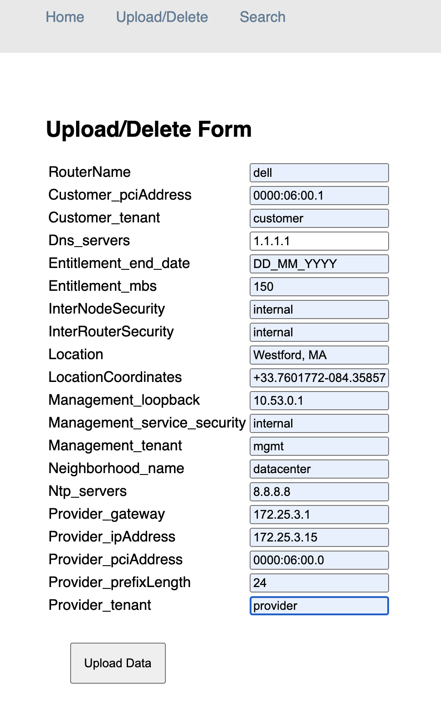

# FSE Provisioner

The FSE Provisioner is an ecosystem of 2 containers, together acting as a web local database and a provisioner web/cli interface to drive config operations to the conductor through the use of REST config and in-product templates.
This document acts as a user/technical guide describing its capabilities and features.

The 2 containers are on the conductor are

- Local DB - provisioner_web_1
- Provisioner - provisioner_PROV_1

An example of the docker container process is shown below.

```
[root@ip-192-168-0-100 centos]# docker ps
CONTAINER ID   IMAGE                    COMMAND                  CREATED          STATUS          PORTS                                       NAMES
3508eefe2111   fse-provisioner:v0.0.1   "/bin/sh -c 'bash -c..."   16 minutes ago   Up 13 minutes   0.0.0.0:3006->3006/tcp, :::3006->3006/tcp   provisioner_PROV_1
63613d9287d3   provisioner_web          "python3 /var/www/ap..."   17 minutes ago   Up 15 minutes   0.0.0.0:5000->5000/tcp, :::5000->5000/tcp   provisioner_web_1
[root@ip-192-168-0-100 centos]#
```


## Local Database

It’s a mongo DB with a UI / API interface to perform CRUD (Add, View, Edit and Delete) operations for branch variables.

The provisioner_web_1 is the Local DB container referenced by the provisioning container to fetch branch/router data.


A file based DB and stores the data in the directory **`/home/centos/provisioner/database/`** as a **`.yml`** file. With the file name being the branch router name.

The **`base.yml`** is the variable data of the conductor required to configure it. This file is created by the cloud.init process and not user-created.

In the example below, the **`dell.yml`** is a branch router named dell, populated in the we by the user. The DB then stores the data in a yml file.

```
[root@ip-192-168-0-100 database]# pwd
/home/centos/provisioner/database
[root@ip-192-168-0-100 database]# ls
base.yml  dell.yml
[root@ip-192-168-0-100 database]#
```


Links to the different web pages of the DB

- Home - [http://conductor-ip:5000/home](http://conductor-ip:5000/home)
- Upload - [http://conductor-ip:5000/upload](http://conductor-ip:5000/upload)
- Search - [http://conductor-ip:5000/search](http://conductor-ip:5000/search)


### 1. Upload Form

The upload form has a couple of fields considered to be unique variables that change site-to-site. All other values (if constant) can hence be offloaded to the template.

Upload - [http://conductor-ip:5000/upload](http://conductor-ip:5000/upload)



#### File content

The **`dell.yml`** contains the same data as shown in the web form but stored in a **`yml`** file format. Alternatively, a user can create an equivalent file conforming to the key requirements. Which the database inturn will read and display as a graphical interface.

```
[root@ip-192-168-0-100 database]# pwd
/home/centos/provisioner/database
```

```
[root@ip-192-168-0-100 database]# cat dell.yml
name: dell
variables:
  customer_pciAddress: '0000:06:00.1'
  customer_tenant: customer
  dns_servers:
  - 1.1.1.1
  entitlement_end_date: DD_MM_YYYY
  entitlement_mbs: '150'
  interNodeSecurity: internal
  interRouterSecurity: internal
  location: Westford, MA
  locationCoordinates: +33.7601772-084.3585778/
  management_loopback: 10.53.0.1
  management_service_security: internal
  management_tenant: mgmt
  neighborhood_name: datacenter
  ntp_servers:
  - 8.8.8.8
  provider_gateway: 172.25.3.1
  provider_ipAddress: 172.25.3.15
  provider_pciAddress: '0000:06:00.0'
  provider_prefixLength: '24'
  provider_tenant: provider
  routerName: dell
[root@ip-192-168-0-100 database]#
```


### 2. Search Form

Clicking the “search” button with an empty “Branch ID” box acts as a “show all” command, listing all the branch data currently stored on the DB.
Alternatively, a user can search for a specific branch ID, by entering the unique router name. In this example “dell” in the search bar.


#### Search Results

The results are loaded row-wise, with the columnar fields.
A branch’s data can then be edited/ deleted by the links highlighted in blue to the left of the row.


## Provisioner

The main function of the provisioner is to perform config operations to the conductor using scripts, local DB and templates.

### Logging into the provisioner

On your conductor, run the command **`docker ps`** which shows all the docker containers currently running on the host.
Make a note of the container name / ID

```
[root@ip-192-168-0-100 centos]# docker ps
CONTAINER ID   IMAGE                    COMMAND                  CREATED          STATUS          PORTS                                       NAMES
3508eefe2111   fse-provisioner:v0.0.1   "/bin/sh -c 'bash -c..."   16 minutes ago   Up 13 minutes   0.0.0.0:3006->3006/tcp, :::3006->3006/tcp   provisioner_PROV_1
63613d9287d3   provisioner_web          "python3 /var/www/ap..."   17 minutes ago   Up 15 minutes   0.0.0.0:5000->5000/tcp, :::5000->5000/tcp   provisioner_web_1
[root@ip-192-168-0-100 centos]#
```

In this example,\
`Container ID - 3508eefe2111`,\
`Container Name - provisioner_PROV_1`

To log into the provisioner, simply run `docker exec -it <container id/name> bash`

Example:

`docker exec -it provisioner_PROV_1 bash`

### Scripts

There are 3 scripts pre-packaged in the provisioner, stored in the directory **`/usr/share/128T-provisioner/scripts`** which are sym-linked to **`/usr/local/bin/`**. Making them globally executable and tab-completable.

All the scripts have a `--help` flag giving a description of what the command does and what are the available flags and expected arguments

- initialize
- list_templates
- fse_add_store

### 1. Initialize

```
[root@provisioner] ~# initialize --help
Usage: initialize [OPTIONS] [TEMPLATE_NAMES]...

Options:
  -v, --verbose  Print more details while running, and more detailed summary
                 of results.
  -h, --help     Show this message and exit.
[root@provisioner] ~#
```


This script initializes the conductor with a given template that resides in the directory **`/usr/share/128T-provisioner/config_templates`**

Note: In the example here, there are 3 templates namely: base, l3nid-add and l3nid-delete

```
[root@provisioner] /# cd /usr/share/128T-provisioner/config_templates/
[root@provisioner] config_templates# ls
base  l3nid-add  l3nid-delete
```

An example of invocation: With the arguments being the templates that reside in the directory **`/usr/share/128T-provisioner/config_templates/`**

```
[root@provisioner] config_templates# initialize base  l3nid-add  l3nid-delete
INFO     - uploading templates base, l3nid-add, l3nid-delete
{'instances': []}
Queried list
Uploaded template
Uploaded template
Uploaded template
[root@provisioner] config_templates#
```

### 2. list_templates

Lists all the templates currently on the conductor, doesn’t need any arguments/flags.

In this example, the 3 templates on the conductor listed are:
`['base', 'l3nid-add', 'l3nid-delete']`

```
[root@provisioner] config_templates# list_templates
INFO     - Querying list of templates from the router
['3.69.81.152']
Queried list
['base', 'l3nid-add', 'l3nid-delete']
[root@provisioner] config_templates#
```

### 3. fse_add_store

Given a template and a list of branch router names as stored in the Database, the

```
[root@provisioner] config_templates# fse_add_store --help
Usage: fse_add_store [OPTIONS] [ROUTERS]...

Options:
  -v, --verbose         Print more details while running, and more detailed
                        summary of results.
  --template-name TEXT  The name of the config template to apply.  [required]
  --force               Force upload the template (when existing).
  --use-test-db         Connect to local test database instead of production
                        database.
  --render-template     Perform commit after applying template.
  --perform-commit      Perform commit after applying template.
  -h, --help            Show this message and exit.
[root@provisioner] config_templates#
```

An example of how to add config for branch router dell would be with the command structure

```
[root@provisioner] config_templates# fse_add_store --use-test-db --render-template --perform-commit --force --template-name l3nid-add dell
```


Where **l3nid-add** is the template name and **dell** is the router name whose config we want to add.

Sample output:

```
[root@provisioner] config_templates# fse_add_store --use-test-db --render-template --perform-commit --force --template-name l3nid-add dell


INFO     - Adding stores dell
{'instances': [{'name': 'dell', 'variables': {'customer_pciAddress': '0000:06:00.1', 'customer_tenant': 'customer', 'dns_servers': ['1.1.1.1'], 'entitlement_end_date': 'DD_MM_YYYY', 'entitlement_mbs': '150', 'interNodeSecurity': 'internal', 'interRouterSecurity': 'internal', 'location': 'Westford, MA', 'locationCoordinates': '+33.7601772-084.3585778/', 'management_loopback': '10.53.0.1', 'management_service_security': 'internal', 'management_tenant': 'mgmt', 'neighborhood_name': 'datacenter', 'ntp_servers': ['8.8.8.8'], 'provider_gateway': '172.25.3.1', 'provider_ipAddress': '172.25.3.15', 'provider_pciAddress': '0000:06:00.0', 'provider_prefixLength': '24', 'provider_tenant': 'provider', 'routerName': 'dell'}}]}
Uploaded template
INFO     - Commiting candidate config
Results:
  dell:
   - Retrieved entry from database:                                                  Success
[root@provisioner] config_templates#
```
